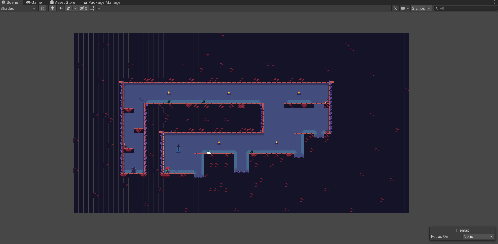
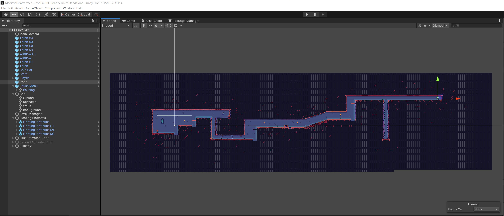
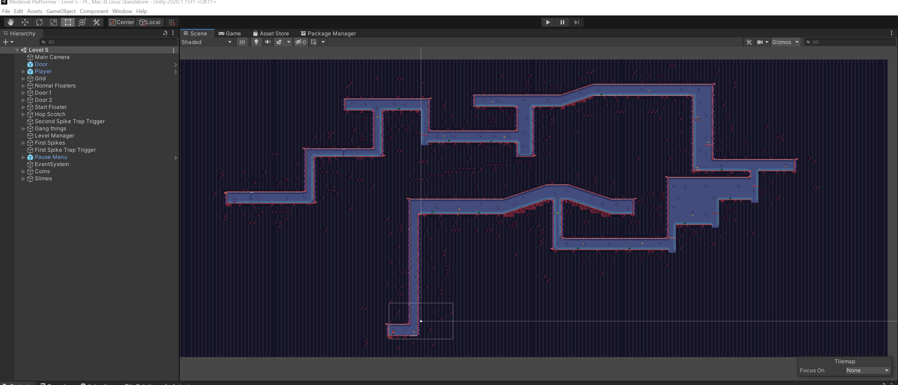

# Medieval Platformer

## How I Made It

Making this game was the first experience of mine using Unity, or doing any sort of game development at all. I used Unity for the vast majority of the development and Visual Studio for making the scripts. This was complete for my Computer Information Systems 11 class. 

## Gameplay

### Objective

In the game you control a redhead knight armed with a sword aptly named the Ginger Knight. Your mission is simple. Get to the door at the end of each level, collecting coins, killing enemies, and dodging traps along the way. Easier said than done. Once the door is reached you will soon be taken to the next level. The difficulty increases with each level so don't get complacent. Pictured below are levels 3, 4, and 5 in that order. 

### Controls

To control the Ginger Knight the player can either use WASD or the arrow keys. The spacebar is used to swing the sword. 
